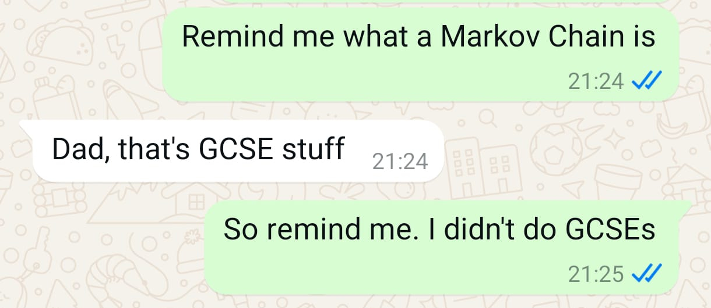

= A Very Small Language Model
Jez Higgins, jez@jezuk.co.uk
{docdate}
:notitle:
:customcss: style/theme-tweak.css
:revealjs_theme: night
:revealjs_totalTime: 4800
:revealjs_progress: true
:revealjs_controls: true
:revealjs_transition: none
:revealjs_slideNumber: c/t
:revealjs_showSlideNumber: speaker

== !

[big]*A Very Small Language Model*

[NOTE.speaker]
--
Hello friends, I'm Jez and this session is the lightest of the day (perhaps even of the week).

It's been a long day, eh? Well, if you fancy more hard thinking there's Dietmar to my right doing Async {cpp}, Robert on my left looking at Monadic Operations in {cpp} (you'll all recall, no doubt that _All told, a monad in X is just a monoid in the category of endofunctors of X, with the cartesian product of sets replaced by composition of endofunctors and unit set by the identity endofunctor_) and round the corner we've got Jutta and Willem doing a couple of shorter talks on development processes.

It's fairly hefty competition, and I'm very flattered you've chosen to be here. This session is, by some measure probably the lightest of the day (even the week), and I hope we can have some fun with some code, and relax a bit before the lightning talks. If, however, having a nice time doesn't appeal, and you think maybe you'd rather skip out to one of the other sessions, I shan't be the least bit offended, so please do vote with you feet if you get the urge.

So, what are we going to do?

We're going to build a bit of magic software in an hour or so.
--

== !

[big]*Magic Software*

[NOTE.speaker]
--
What do I mean by magic software?

There are lots of things in software that seem kind of amazing, even to people who work in software. Operating systems, compilers & interpreters, windowing systems - things we use all day every day - are obvious choices. Sat navs! Lots of game stuff - I'm not just talking about graphics rendering, but things like in-game AI. Satnavs, they're pretty cool.

Does anyone here play Dominion? There's a lovely version of Dominion for your tablet, and the computer opponents are really, really good.

Even the more mundane stuff can be fascinating - there was an incredible article about Hans Boehm's calculator app. It magical because it can do (10^100) + 1 − (10^100) correctly through the miracle of quite a lot of hard maths.

These are, however, all pretty large topics. You can’t write an operating system, or even a calculator, in  a 90 minute session. I can’t anyway. I am not Ken Thompson.
--

=== Dominion

[NOTE.speaker]
--
This is the start of a game of Dominion. It's a deck builder game, so you start with a handful of cards, and as the game progresses you gain more cards from the middle here.

Each of these action cards has a different effect, these over here can be used to modify the behaviour of them. The aim is get the most of these green cards over here, but you don't want to go to early, because they're otherwise useless and take up space in your hand here.

There's a lot to balance.  And every game is almost guaranteed to be unique - there are hundreds of these different action cards, and so you might need a very different approach from one game to the next.

The computer opponents are really good, particularly because they will play the same cards in different ways. It doesn't just come up with one optimised path, it'll do different things, sometimes in response to what you do and sometimes because, I don't know, it just feels like it.

It's terrific. I have no idea how it does it, it's just great.
--

=== CycleStreets LiveRide

something about satnavs here

== !

image::images/hello-keyboard.png[]

[NOTE.speaker]
--
So, about this time last year, I was poking around on my phone doing something or other, and my keyboard suddenly asked me if I want to turn on some kind of AI assistant to “boost productivity” and “unlock creativity”.

Obviously, I said no, because honestly, how much productivity boosting and creativity unlocking do you to send WhatsApp messages? And, in any case, it can’t do that.

However, it did get me thinking. It did! Really - I'm not giving you some kind of trite homily here - I promise you it did.

We are all, of course, familiar with how phone keyboards in particular, and more widely the general act of typing things on a computer, offer up suggestions for the word you're currently typing, and also the next word you might want to type.

The first time I encountered next word prediction was in late 1991 or early 1992, in a piece of schools' software. It was, for all intents and purposes, a word processor, and it was intended to help children with specific learning difficulties (dyspraxia, dysgraphia, dyslexia, or whatever) write more easily. As you typed, it popped up a selection of suggested words and you could just pick them off the list. I think it would also suggest next words. Commonplace these days, but really quite startling, even slightly spooky and magical, if you've never seen it before.

Now, here was a keyboard rebranding “next word prediction” as “AI assistance”. This is an attempt to group this technology in the same bucket as the ChatGPTs and the Claudes and what have you. It's trying to stoke up the idea that text prediction is a hard problem, something best left to the big brains at Google or Apple or Microsoft with their shiny offices and free lunches in Silicon Valley and Redmond
--

== !

[.text-right]
--
[.small]#Photo courtesy of Dejdżer / Digga, \https://commons.wikimedia.org/wiki/File\:Acorn_BBC_Master_Series.jpg#
--

[NOTE.speaker]
--
But, hang on, if a BBC Master system could do this 35 years ago, how hard could it be?

Can we build one in an hour?
--

== !

[.big]#Spoiler: YES#

[NOTE.speaker]
--
Before we find out, I'd just like to let you know that all the code we'll be looking at today will be in JavaScript.

My first language is {cpp} (it's not, by you know what I mean), and perhaps because of that, I’ve had conversations with people who work in C# or Python or PHP or similar and they'll say something like _all that low-level stuff is too complicated for them_. Is that familiar to anyone here? I’ve also encountered a bit of the reverse - {cpp} (and C and assembler) snobs who look down the noses at languages you can’t cause a segfault with and, by extension, the people who use them.

The latter are probably beyond redemption, but it kind of boils my piss that there are programmers who’ve taken some of that snobbery onto themselves and accept that it’s founded in any kind of truth. {cpp} programmers aren’t on some rarefied mountain top. Programming’s programming. Software’s the most malleable medium we could wish to work in. Anybody can do anything in software.

So, I'm doing this in JavaScript :D  If we can do magic stuff in JavaScript, then we can do anything.

Besides, it fits on slides better
--

== Remember

[.big]#You can switch to another talk any time you like#

[NOTE.speaker]
--
That's the preamble. Shall we get started?

I've used the phrase "magic software" a few times now. I don't necessarily mean it's particularly unknown, or requires deep knowledge, or anything like that. Writing an operating system is pretty well described and has been for decades. Sometimes all you need a half a clue and to bash away it for a while.
--

== !

The Half A Clue

[.big]#Markov Chains#

[NOTE.speaker]
--
The half a clue I had was the name "Markov chain". I knew you that was something to do with it, and kind of vaguely knew it was something to do with probability.

So I messaged by son Daniel, who's got a degree in Maths and Statistics, and is doing a PhD in Stochastic Epidemiology -
--

== !

image::images/whats-a-markov-chain.jpeg[]

[NOTE.speaker]
--
Classic Dad behaviour - pretending I know but it's just slipped my mind.
--

== !

image::images/gcse-stuff.jpeg[]

[NOTE.speaker]
--
Hmm
--

== !

[NOTE.speaker]
--
Ok, so he just needs a bit of chivvying along
--

== !

image::images/fossil.jpeg[]

[NOTE.speaker]
--
So it was at this point I turned to other sources.

I did send him another message, but the last time I said a naughty word during a talk the video didn't get published.
--

== !

[quote]
--
A Markov chain is a stochastic process describing a sequence of possible events in which the probability of each event depends only on the state attained in the previous event.
--

[NOTE.speaker]
--
A random process in which the transition probability only depends on where you are right now (i.e. the future is independent of the past).

* _stochastic process_ - this is mathematician talk for _random process_
* _sequence of events_ - we can keep going
* _probability of each event depends only on the state attained in the previous event_ -  what happens next depends only on where we are now, not on how we got here, the future is independent of the past

* it's called a Markov chain for Andrey Markov, who was a Russian mathematician who did a lot of work on stochastic processes around the turn of the 20th Century - 1856 to 1922.
--

== !

[graphviz, layout=sfdp, width=600]
----
digraph finite_state_machine {
	fontname="Helvetica,Arial,sans-serif"
	node [fontname="Helvetica,Arial,sans-serif"]
	edge [fontname="Helvetica,Arial,sans-serif"]
	rankdir=LR;
	node [shape = circle] B A C;
 	A -> C [label = "0.6"];
	A -> B [label = "0.4"];
    B -> C [label = "0.3"];
    B -> A [label = "0.7"];
    C -> B [label = "0.4"];
    C -> A [label = "0.4"];
    C -> C [label = "0.2"];
}
----

[NOTE.speaker]
--
Here's a little Markov process.

If we start over here in State A, then the probability of us moving to state B is 0.4, and the probability of moving to state C is 0.6. So, B or C? Let's hear it for B! Let's hear it for C!

Note that the sum of the state transition probabilities is always 1. Even if we can stay where we are, that's still a transition, still gets its own probability.

We're all programmers, the probability that we didn't even
notice that this is a discrete-time Markov chain approaches 1. You can build continuous time Markov processes, but I've no idea how you'd actually do that, and it probably involves some kind of fearsome calculus, so let's pretend I never even mentioned it.

So, we have this little state space, that we're randomly and memorylessly mocing around. These have, perhaps surprisingly, a number of real world applications

* Including in macroeconomics - stock price equilibrium, for example, and various Monte Carlo simulations
* Markov chains can be used to model interaction between state actors. We may have to reevaluate that in the light of recent events, but it's been done.
* They have application in algorithmic music generation
* Baseball analytics, apparently (and perhaps not real world)

And, of course, since you've all read the synopsis of this session, you can use Markov chains for algorithmic text generation
--

== !

[.big]#Algorithmic text generation#

[NOTE.speaker]
--
How do we apply Markov chains to text generation?
--

== !

[graphviz, layout=sfdp, width=600]
----
digraph finite_state_machine {
	fontname="Helvetica,Arial,sans-serif"
	node [fontname="Helvetica,Arial,sans-serif"]
	edge [fontname="Helvetica,Arial,sans-serif"]
	rankdir=LR;
	node [shape = circle] B A C;
 	A -> C [label = "0.6"];
	A -> B [label = "0.4"];
    B -> C [label = "0.3"];
    B -> A [label = "0.7"];
    C -> B [label = "0.4"];
    C -> A [label = "0.4"];
    C -> C [label = "0.2"];
}
----

== !

[graphviz, layout=sfdp, width=600]
----
digraph finite_state_machine {
	fontname="Helvetica,Arial,sans-serif"
	node [fontname="Helvetica,Arial,sans-serif"]
	edge [fontname="Helvetica,Arial,sans-serif"]
	rankdir=LR;
	node [shape = circle] B A C;
    A [label = "hello"];
 	A -> C [label = "0.6"];
	A -> B [label = "0.4"];
    B -> C [label = "0.3"];
    B -> A [label = "0.7"];
    C -> B [label = "0.4"];
    C -> A [label = "0.4"];
    C -> C [label = "0.2"];
}
----

[NOTE.speaker]
--
Well, what if instead of state A we had "hello"
--

== !

[graphviz, layout=sfdp, width=600]
----
digraph finite_state_machine {
	fontname="Helvetica,Arial,sans-serif"
	node [fontname="Helvetica,Arial,sans-serif"]
	edge [fontname="Helvetica,Arial,sans-serif"]
	rankdir=LR;
	node [shape = circle] B A C;
    A [label = "hello"];
    B [label = "there"];
 	A -> C [label = "0.6"];
	A -> B [label = "0.4"];
    B -> C [label = "0.3"];
    B -> A [label = "0.7"];
    C -> B [label = "0.4"];
    C -> A [label = "0.4"];
    C -> C [label = "0.2"];
}
----

[NOTE.speaker]
--
Instead of state B we had "there"
--

== !

[graphviz, layout=sfdp, width=600]
----
digraph finite_state_machine {
	fontname="Helvetica,Arial,sans-serif"
	node [fontname="Helvetica,Arial,sans-serif"]
	edge [fontname="Helvetica,Arial,sans-serif"]
	rankdir=LR;
	node [shape = circle] B A C;
    A [label = "hello"];
    B [label = "there"];
    C [label = "world"];
 	A -> C [label = "0.6"];
	A -> B [label = "0.4"];
    B -> C [label = "0.3"];
    B -> A [label = "0.7"];
    C -> B [label = "0.4"];
    C -> A [label = "0.4"];
    C -> C [label = "0.2"];
}
----

[NOTE.speaker]
--
And instead of state C, we had, of course, Brian Kernighan approved word "world"

So, if we start at "hello", we might transition to, aka generate the next word, "there", or we might generate "world".

Start at "hello". Pick a number. Transition to, aka generate the next world, "world".

Try again, start at "hello". Pick a number. Move to "world"

Try again, start at "hello". Pick a number. Move to "there"

And lo, we algorithmic text generation. I mean, it's not huge, but it's not nothing.
--

