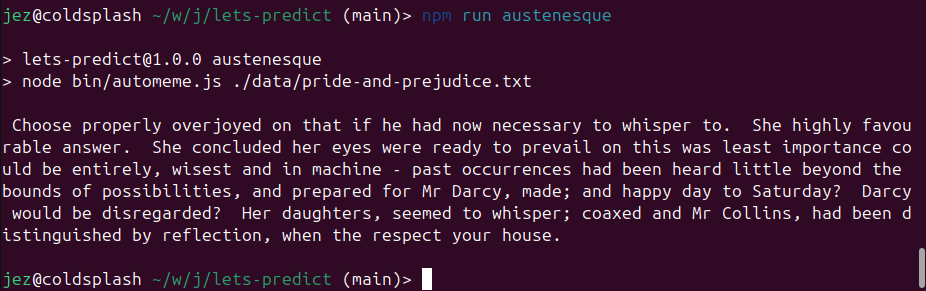

= A Very Small Language Model
Jez Higgins, jez@jezuk.co.uk
{docdate}
:notitle:
:customcss: style/theme-tweak.css
:revealjs_theme: night
:revealjs_totalTime: 4800
:revealjs_progress: true
:revealjs_controls: true
:revealjs_transition: none
:revealjs_slideNumber: c/t
:revealjs_showSlideNumber: speaker

[background-image="images/title-card.png"]
== !

[NOTE.speaker]
--
Hello friends, I'm Jez.

It's been a long day, eh? Well, if you fancy more hard thinking there's Dietmar to my right doing Async {cpp}, Robert on my left looking at Monadic Operations in {cpp} (you'll all recall, no doubt that _All told, a monad in X is just a monoid in the category of endofunctors of X, with the cartesian product of sets replaced by composition of endofunctors and unit set by the identity endofunctor_) and round the corner we've got Jutta and Willem doing a couple of shorter talks on development processes.

It's fairly hefty competition, and I'm very flattered you've chosen to be here. This session is, by some measure probably the lightest of the day (even the week), and I hope we can have some fun with some code, and relax a bit before the lightning talks. If, however, having a nice time doesn't appeal, and you think maybe you'd rather skip out to one of the other sessions, I shan't be the least bit offended, so please do vote with you feet if you get the urge.

So, what are we going to do?

We're going to build a bit of magic software in an hour or so.
--

== !

[big]*Magic Software*

[NOTE.speaker]
--
There are lots of things in software that seem kind of amazing, even to people who work in software. Operating systems, compilers & interpreters, windowing systems - things we use all day every day - are obvious choices.

I mean, does anyone really understand operating systems? We passed the comprehension limit (which I'm going to confidently state is about 10 thousand lines but without the reference to back it up) for operating systems with 6th Edition Unix. It's incredible they work at all!

Perhaps operating systems are less a source of wonder, and more a source of irritation to the wider population?

Sat navs! They're pretty cool, although obviously they need a lot of specialist hardware, and a whole load of mapping data.
--

== !

cyclestreets image

[NOTE.speaker]
--
Here's a satnav in action - it's getting real time GPS updates, so it's able to show position, heading, and speed (to within a couple of metres, so Heisenberg bugs are not an issue). We've got a map data, so we know how far to the next turning and which way we need to turn, how much of the journey distance is left, how much of the journey we've already covered and how quickly so it can calculate how long it'll take to arrive.

Lots of games stuff is pretty amazing - I'm not just talking about graphics rendering, but things like in-game opponents
--

== !

image::images/Dominion.jpg[]

[NOTE.speaker]
--
This is the start of a game of Dominion. It's a deck builder game, so you start with a handful of cards, and as the game progresses you gain more cards from the middle here.

Each of these action cards has a different effect, these over here can be used to modify the behaviour of them. The aim is get the most of these green cards over here, but you don't want to go to early, because they're otherwise useless and take up space in your hand here.

There's a lot to balance.  And every game is almost guaranteed to be unique - there are hundreds of these different action cards, and so you might need a very different approach from one game to the next.

The computer opponents are really good, particularly because they will play the same cards in different ways. It doesn't just come up with one optimised path, it'll do different things, sometimes in response to what you do and sometimes because, I don't know, it just feels like it.

It's terrific. I have no idea how it does it, it's just great.
--

== !

image::images/calculator.png[]

[NOTE.speaker]
--
Even the more mundane stuff can be fascinating, once you know about it. There's  an incredible article about Hans Boehm's calculator app. It magical because it can do (10^100) + 1 − (10^100) correctly through the miracle of quite a lot of hard maths.

These are, however, all pretty large topics. You can’t write an operating system, or even a calculator, in the time available to us today. I can’t anyway. I am not Ken Thompson.
--

== !

image::images/hello-keyboard.png[]

[NOTE.speaker]
--
So, about this time last year, I was poking around on my phone doing something or other, and my keyboard suddenly asked me if I want to turn on some kind of AI assistant to “boost productivity” and “unlock creativity”.

Obviously, I said no, because honestly, how much productivity boosting and creativity unlocking do you to send WhatsApp messages? And, in any case, it can’t do that.

We are all, of course, familiar with how phone keyboards in particular, and more widely the general act of typing things on a computer, first of all act as spelling correction on the word you're typing, but also to prompt you with the next word _you might want to type_.

You might have occasionally played that game where you just accept the suggestions it gives you ...
--

== !

[NOTE.speaker]
--
The first time I encountered next word prediction was in late 1991 or early 1992, in a piece of schools' software. It was, for all intents and purposes, a word processor, and it was intended to help children with specific learning difficulties (dyspraxia, dysgraphia, dyslexia, or whatever) write more easily. As you typed, it popped up a selection of suggested words and you could just pick them off the list. It could also suggest next words.

Commonplace these days, but really quite startling, even slightly spooky and magical, if you've never seen it before.

Now, here was a keyboard rebranding “next word prediction” as “AI assistance”. This is an attempt to group this technology in the same bucket as the ChatGPTs and the Claudes and what have you. It's trying to stoke up the idea that text prediction is a hard problem, something best left to the big brains at Google or Apple or Microsoft with their shiny offices and free lunches in Silicon Valley and Redmond.

Now, I don't know about you, and with respect to Anastasia, I think our general experience of the AI chatbots has not been magical. Quite the contrary.

These guys (and you know it's guys) are overselling text prediction :)
--

== !

image::images/Acorn_BBC_Master_Series_Transparent.png[]

[.text-right]
--
[.small]#Photo courtesy of Dejdżer / Digga, \https://commons.wikimedia.org/wiki/File\:Acorn_BBC_Master_Series.jpg#
--

[NOTE.speaker]
--
So, I thought, if a BBC Master system could do this 35 years ago, how hard could it be?

Could I recreate the magic?
--

== !

[.big]#In an hour?#

[NOTE.speaker]
--

I'm not quite sure where this came from, but I'd just sat down to watch a FIH ProLeague hockey match at the same time. Can't remember which one - there was a lot of hockey last February, but I remember it was really good. Possibly it was India vs Spain, which went to 8-7 in shuffles after a 2-2 draw. Anyway. International hockey matches are 60 minutes long, so maybe that was it.

Next ProLeague hockey is the 7 June btw - when there is frankly too much on. Spain-Argentina double header from Valencia, then Netherlands-Australia women and Netherlands-India men from the Wagener in Amstelveen. Should all be amazing. I'm predicting Spain women, Spain men, Netherlands women (never bet against the Dutch women), and, oh, India. Point is, no such distractions today - only distractions of my own making.
--

== !

[.big]#Spoiler: YES#

[NOTE.speaker]
--
Before we find out, I'd just like to let you know that all the code we'll be looking at today will be in JavaScript.

My first language is {cpp} (it's not, by you know what I mean), and perhaps because of that, I’ve had conversations with people who work in C# or Python or PHP or similar and they'll say something like _all that low-level stuff is too complicated for them_. Is that familiar to anyone here? I’ve also encountered a bit of the reverse - {cpp} (and C and assembler) snobs who look down the noses at languages you can’t cause a segfault with and, by extension, the people who use them.

The latter are probably beyond redemption, but it kind of boils my piss that there are programmers who’ve taken some of that snobbery onto themselves and accept that it’s founded in any kind of truth. {cpp} programmers aren’t on some rarefied mountain top. Programming’s programming. Software’s the most malleable medium we could wish to work in. Anybody can do anything in software.

So, I'm doing this in JavaScript :D  If we can do magic stuff in JavaScript, then we can do anything.

Besides, it fits on slides better
--

== Remember

[.big]#You can switch to another talk any time you like#

[NOTE.speaker]
--
That's the preamble. Shall we get started?

I've used the phrase "magic software" a few times now. I don't necessarily mean it's particularly unknown, or requires deep knowledge, or anything like that. Writing an operating system is pretty well described and has been for decades.

What I mean is the effect is magical, in some way

To implement it, sometimes all you need a half a clue and to bash away it for a while.
--

== !

The Half A Clue

[.big]#Markov Chain#

[NOTE.speaker]
--
The half a clue I had was the name "Markov chain". I knew that was something to do with it, and kind of vaguely knew it was something to do with probability.

So I messaged by son Daniel, who's got a degree in Maths and Statistics, and is doing a PhD in Stochastic Epidemiology -
--

== !

[NOTE.speaker]
--
Classic Dad behaviour - pretending I know but it's just slipped my mind.
--

== !

[NOTE.speaker]
--
Hmm
--

== !

image::images/again.jpeg[]

[NOTE.speaker]
--
Ok, so he just needs a bit of chivvying along
--

== !

[NOTE.speaker]
--
So it was at this point I turned to other sources.

I did send him another message, but the last time I said a naughty word during a talk the video didn't get published.
--

== !

[quote]
--
A Markov chain is a stochastic process +
describing a sequence of possible events +
in which the probability of each event +
depends only on the state attained in the previous event.
--

[NOTE.speaker]
--
A Markov chain is a stochastic process +
describing a sequence of possible events +
in which the probability of each event +
depends only on the state attained in the previous event.

* _stochastic process_ - this is mathematician talk for _random process_
* _sequence of events_ - we can keep going
* _probability of each event depends only on the state attained in the previous event_ -  what happens next depends only on where we are now, not on how we got here, the future is independent of the past

* it's called a Markov chain for Andrey Markov, who was a Russian mathematician who did a lot of work on stochastic processes around the turn of the 20th Century - 1856 to 1922.

--

== !

[plantuml, state-diagram-1, svg, width=600]
----
object A
object B
object C
object D
A --> B : 0.5
A --> C : 0.25
A -r-> D : 0.25
B --> A : 0.2
B -r-> C : 0.8
C --> A : 0.4
C --> B : 0.4
C --> C : 0.2
D --> C : 0.5
D --> A : 0.5
----

[NOTE.speaker]
--
Here's a little Markov process.

If we start over here in State A, then the probability of us moving to state B is 0.5, and the probability of moving to state C is 0.25, and to D is 0.25. So, B or C? Let's hear it for B! Let's hear it for C!

Note that the sum of the state transition probabilities is always 1. Even if we can stay where we are, that's still a transition, still gets its own probability.

We're all programmers, the probability that we didn't even
notice that this is a discrete-time Markov chain approaches 1. You can build continuous time Markov processes, but I've no idea how you'd actually do that, and it probably involves some kind of fearsome calculus, so let's pretend I never even mentioned it.

So, we have this little state space, that we're randomly and memorylessly moving around. These have, perhaps surprisingly, a number of real world applications

* Including in macroeconomics - stock price equilibrium, for example, and various Monte Carlo simulations
* Markov chains can be used to model interaction between state actors. We may have to reevaluate that in the light of recent events, but it's been done.
* They have application in algorithmic music generation
* Baseball analytics, apparently (and perhaps not real world)

And, of course, since you've all read the synopsis of this session, you can use Markov chains for algorithmic text generation
--

== !

[.big]#Algorithmic text generation#

[NOTE.speaker]
--
How do we apply Markov chains to text generation?
--

== !

[plantuml, state-diagram-2, svg, width=600]
----
object A
object B
object C
object D
A --> B : 0.5
A --> C : 0.25
A -r-> D : 0.25
B --> A : 0.2
B -r-> C : 0.8
C --> A : 0.4
C --> B : 0.4
C --> C : 0.2
D --> C : 0.5
D --> A : 0.5
----

[NOTE.speaker]
--
Here's the little state transition diagram we had before. Let's strip it right back.
--

== !

[plantuml, state-diagram-stripped, svg, width=600]
----
object A
object B
object C
object D
A --> B : 0.5
A --> C : 0.25
A -r-> D : 0.25
----

== !

[plantuml, state-diagram-3, svg, width=600]
----
object A
A : hello
object B
object C
object D
A --> B : 0.5
A --> C : 0.25
A -r-> D : 0.25

----

[NOTE.speaker]
--
Well, what if instead of state A was associated with "hello"
--

== !

[plantuml, state-diagram-4, svg, width=600]
----
object A
A : hello
object B
B : there
object C
object D
A -r-> B : 0.5
A --> C : 0.25
A --> D : 0.25
----

[NOTE.speaker]
--
Instead of state B we had "there"
--

== !

[plantuml, state-diagram-5, svg, width=600]
----
object A
A : hello
object B
B : there
object C
C : everybody
object D
A -r-> B : 0.5
A --> C : 0.25
A --> D : 0.25
----

[NOTE.speaker]
--
On state C we had "everybody"
--

== !

[plantuml, state-diagram-6, svg, width=600]
----
object A
A : hello
object B
B : there
object C
C : everybody
object D
D : world
A -r-> B : 0.5
A --> C : 0.25
A --> D : 0.25
----

[NOTE.speaker]
--
And instead of state C, we had, of course, the Brian Kernighan approved word "world"

So, if we start at "hello", we might transition to, aka generate the next word, "there", or we might generate "world".

Start at "hello". Pick a number. Transition to, aka generate the next world, "world".

Try again, start at "hello". Pick a number. Move to "world"

Try again, start at "hello". Pick a number. Move to "there"

And lo, we algorithmic text generation. I mean, it's not huge, but it's not nothing.

*So that's it right? End of talk.*

I'd buy you all a drink but I'm not sure I can afford it at Bristol prices.

What's the missing step here?
--

== !

[.big]#How do we know what the probabilities are?#

[NOTE.speaker]
--
How do we know what the probabilities are?
--

== !

[source, javascript]
----
import {make_chain} from "../src/chain.mjs";

const chain = make_chain()

chain.add('hello', 'there')
chain.add('hello', 'everyone')
chain.add('hello', 'there')
chain.add('hello', 'world')
----

[NOTE.speaker]
--
Here's some code.

Within this `chain` object, we've put together a little data structure that looks somwething like this.
--

== !

[source]
----
hello  ->  (world, 1)
           (there, 2)
           (everyone, 1)
----

[NOTE.speaker]
--
We can see that looks quite similar to our little state transition diagram we had before, except instead of probabilities we've got occurrence counts.
--

== !

[source, javascript]
----
for (let i = 0; i !== 10; ++i)
  console.log("hello " + chain.predict("hello"));
----

[NOTE.speaker]
--
When we call `predict`, we pluck some magic number, convert those occurrences into probabilities, and lo and behold, out come some greetings.

This is obviously as almost minimal as you can get. We have one starting word, and all the following words are terminal.

We barely even have any code
--

include::chain.adoc[]

== !

[source, javascript]
----
for (let i = 0; i !== 10; ++i)
  console.log("hello " + chain.predict("hello"));
----

[NOTE.speaker]
--
So, how do we make this a bit more that a simple greetings generator?

We need some more words. We need a Text Corpus
--

== !

[.big]#a Text Corpus#

[NOTE.speaker]
--
Now, in more formal terms, a text corpuses large and systematic. They're gathered using some system, some methodology - for a particlarly time period, or geographic location, population, or some combination thereof.

For example the Corpus of London Teenage Speech is a set of samples of spoken English, collected in 1993 from recorded and transcribed conversations by teenagers between the ages of 13 and 17. It's about half a million words, and contains 67 examples of the word 'bum', which I don't think is enough.

Now, I don't have access to any of those academic corpuses, nor did I really just want to go off and download large chunks of the publically available internet.

For my purposes I was rather less formal, and used a text corpus I was able to get full and unconditional permission to use.
--

== !

image::images/toots.png[]

[NOTE.speaker]
--
From myself!

I used my Mastodon archive.
--

[background-iframe="files/toots.html"]
== !

[NOTE.speaker]
--
Here it is. 2384 scintillating lines, every one a certified zinger, containing 46576 individual words.

I've cleaned it up a little to take out other people's handles, and, erm, remove the stronger swearwords -

and looking it now, it already looks like it was generated by some kind of stochastic process. Hmm.

So, how do we build a model from this?
--

== !

The last thing I did today was delete a file called 'burp.md'

I don't think this is quite as reassuring as you think it is 😉

Is this the code phrase to activate a sleeper agent?

1 or infinity, yea. Those are the only two numbers that matter.

As long as there's plenty of space to clop around on your horse, who really cares?

[NOTE.speaker]
--
We're going to take each line in turn, and split it into pairs of words.

More precisely pairs of tokens.
--

== !

[.big]#pass:[<u>[Is, this\]</u>] the code phrase to activate a sleeper agent?#

== !

[.big]#Is pass:[<u>[this, the\]</u>] code phrase to activate a sleeper agent?#

== !

[.big]#Is this pass:[<u>[the, code\]</u>] phrase to activate a sleeper agent?#

== !

[.big]#Is this the pass:[<u>[code, phrase\]</u>] to activate a sleeper agent?#

== !

[.big]#Is this the code pass:[<u>[phrase, to\]</u>] activate a sleeper agent?#

== !

[.big]#Is this the code phrase pass:[<u>[to, activate\]</u>] a sleeper agent?#

== !

[.big]#Is this the code phrase to pass:[<u>[activate, a\]</u>] sleeper agent?#

== !

[.big]#Is this the code phrase to activate pass:[<u>[a, sleeper\]</u>] agent?#

== !

[.big]#Is this the code phrase to activate a pass:[<u>[sleeper, agent\]</u>]?#

[NOTE.speaker]
--
What should we do now? Include the question mark, or not include the question mark? As part of the work, or as a token of its own?

Up to you. I chose to have it as a token of its own
--

== !

[.big]#Is this the code phrase to activate a sleeper pass:[<u>[agent, ?\]</u>]#

[NOTE.speaker]
--
Often we think of parsing as quite a sophisticated task. Not so here. It's slightly more sophisticated than splitting on spaces, although not much more.
--

== !

[source, javascript]
----
function* tokenise(input) {
  const stream = streamer(input);

  let c = stream.next();
  while (stream.hasNext()) {
    while (isWhitespace(c))
      c = stream.next();

    let token = "";
    for ( ; isAlphanumeric(c); c = stream.next())
      token += c;

    if (token)
      yield token;

    for (; isOtherCharacter(c); c = stream.next())
      yield c;
  }
}
----

[NOTE.speaker]
--
Here we are - this is the tokeniser I put together.

For those of you not familiar, this `function*` means this is a JavaScript generator. If you know Python generators, it's the same but with more curly brackets. It's akin to coroutine - you can yield values, then continue on from there.

`streamer` just puts a little `next`/`hasNext` face on the input, so we can loop over it more easily.

We start by discarding whitespace, then gather up anything that looks like it could be part of a word and yield that, then if there's any punctuation yield that, and round and round until we run out, yielding up a token at a time.

If we put another little layer on top, we can return pairs of words ...
--

=== !

[source, javascript]
----
function streamer(input) {
  let index = 0;
  return {
    next: () => (index !== input.length ? input[index++] : null),
    hasNext: () => index !== input.length,
  };
}
----

== !

[source, javascript]
----
async function* wordPairs(filename) {
  const file = await open(filename);

  let prev = null;
  for await (const line of file.readLines()) {
    for (const token of tokenise(line)) {
      yield [prev, token];
      prev = token;
    }
  }
  yield [prev, null];
}
----

[NOTE.speaker]
--
Does this async/await trouble anyone?

So we've got our `tokenise` generator splitting out toots into tokens, then we've layered another generator around it to pair up those tokens.

We are, essentially running a sliding window over our input stream.

So, we have our pairs of tokens - one at the front, one at the back - are we're just going to build a big list of the tokens in the front, with whatever comes after them and, crucially, how many times each of the following tokens occurs
--

== !

[source,javascript]
----
const chain = make_chain();

for await (const [word, follower] of wordPairs('./data/toots.txt'))
  chain.add(word, follower);
----

[NOTE.speaker]
--
We're reading all our pairs of words, we're popping them into the chain, to build up a big list...

So, what does that give us.
--

== !

[code]
----
is      ->  (a, 59)
            (the, 24)
            (',', 20)
            (that, 17)
            ... 207 other tokens ...
            (rarely, 1)

grateful -> (to, 1)
            (!, 1)
            (nation, 1)

...
----

[NOTE.speaker]
--
Our data structure now looks something like this.

And so on, for another 8379 tokens.  8379 seems like a lot, but I can only assume there are a lot of a) names and b) horrific misspellings in there.  There are approximately 35000 state transitions between all those tokens. I tried to get PlantUML to draw the diagram, but I gave up after 24 hours.

All this is clear, yes? We can read our source corpus, generating a series of token pairs, producing a big list of each unique token we encounter, together with the counts of the tokens that follow.

If we now take our starter word, "hello", and use that generator our next word, we can take the new word and plug it back in, to get another word, and so on and so on.

And we have recreated our little keyboard game
--

== !

[source,javascript]
----
const tokens = ['hello']

for (let i = 0; i !== 12; ++i)
  tokens.push(chain.predict(tokens[tokens.length - 1]));

console.log(tokens.join(' '));
----

[NOTE.speaker]
--
So that's what we're doing here. We've our starter word, hello, and each time we go round this loop, we use that last word in the array to generate a new word, which we push onto the array.

Then we print it
--

=== !

[source,javascript]
----
const tokens = ['hello']

for (let i = 0; i !== 12; ++i) {
  const current_word = tokens[tokens.length - 1];
  const next_word = chain.predict(current_word);
  tokens.push(next_word);
}

console.log(tokens.join(' '));
----

[NOTE.speaker]
--
Would love a pipeline operator here.
--

== !

[NOTE.speaker]
--
And we get this nonsense.

We know this is just a random spray of words, but there are little phrases and things that look almost plausible in there.

What else do you notice about it?

Lots of punctuation after hello. Turns out hello is a really bad starter word for this particular corpus. I've talked a lot on Mastodon about the code I was writing, and about this talk. And my favourite word was "hello"
--

[background-iframe="files/hello.html"]
== !

[NOTE.speaker]
--
And my favourite example word was "hello". I am, it seems, nothing if not predictable

This is interesting, right? This, I'd suggest, is unexpected because hello seems like a perfectly normal word, but in this corpus, it has a certain quirk, a certain characteristic.

Because, our little sliding of word pairs, our occurrence counts have captured something about this body off text.
--

== !

[.big]#A model#

[NOTE.speaker]
--
We have, in fact, built a model.

A model of the particular dialect of English I speak on Mastodon.
--

== !

[NOTE.speaker]
--
Here's the same code, the same text rerun with a different seed word - 'the'.  Now, we'd expect this to give some quite different results, because of the nature of the word we've chosen.

What if we start with a different body of text?
--

== !

[NOTE.speaker]
--
I still haven't gone off and downloaded large chunks of the public internet. Here, I've used the text of Pride and Prejudice. I've never read it, but my computer has read it for me, and produced these little summaries.  I think I've got the gist.

Pride and Prejudice was published in 1813, so the word hello doesn't appear in the text, but the works splendidly.

Very different feel, right? Pride and Prejudice has about three times as many words as my Mastodon archive, so this is a much bigger model. I don't know necessarily it's more complex - whether Austen's vocabulary is bigger than mine, or her sentence structure more complex, or whatever.

What am I doing? Comparing myself to Jane Austen!

But, could we?

If we had an unknown body of text, could we use our models to say "this is more like Jez's internet spoutings" or "this is more like one of the greatest novelists in the English language"?
--

== !

[NOTE.speaker]
--
Here's some samples from a third corpus - the text of all the Sherlock Holmes novels and stories.

Again, very different feel, from the previous two, but I think it's not as distinctive. No giveaways - no Watson, no Holmes.

We've taken another big step up in word count - up to 650 thousand words - five times as many as Pride and Prejudice and getting on for 15 times as many words as in my toot archive. But we've also changed another dimension.

My toots, and Pride and Prejudice represent quite a compressed time frame - everything was written over the course of a few months.

A Study in Scarlet was first published in 1887, while the last Holmes story (or at least the last by Conan Doyle), The Adventure of the Retired Colourman, was published in 1926. So these stories cover a span of 40 years. English usage would have morphed and evolvedin that time, and we know that Conan Doyle's attitude to writing had changed. He tried to pack in Holmes at least twice - that's what the fight with Moriaty at the Reichenbach Falls in The Final Problem was trying to. (Didn't work - subsequently wrote another 30 short stories and 2 novels)

So all these factors - the size, the time span, maybe even the different settings of the stories (we think about Holmes being set in London, but he's forever on the train to the West Country, or wherever) - perhaps make this model less distinctive.

How could we help it? How could we make our model better?

To give you a little bit of context, we're into the 4th quarter of the match now. Time is tight, so nothing too ambitious.
--

== !

Is this the code phrase to activate a sleeper agent?

[NOTE.speaker]
--
Probably the easiest thing we can do is improve our tokenisation. As I said before it's slightly more involved than splitting on whitespace, but only just.

But we know this is a sentence, written in English.

English has a grammar - I mean we might not be able to write it down in EBNF, but there are generally agreed ways in which we use the language.

We know, for example, that this question mark indicates the end of a sentence. What if we just highlight that?
--

== !

!Start! Is this the code phrase to activate a sleeper agent? !End!

[NOTE.speaker]
--
This is I came up with on the spur of the moment

We pop a special little token in at the start of a sentence, and then a special little token at the of the line.

So, as we run our sliding window across the text, we're annotating with a little bit of extra information. We're saying some of these words occur at the start of a line, and some of these things occur at the end of a line. We're also saying an end is followed by a start.

It's a tiny little thing, right?

But it actually makes a pretty big change. We don't a seed word anymore - we can use the Start of Line token to kick off our generation. Once we encounter an End of Line, we can stop, because we know we've generated a sentence.
--

== !

[NOTE.speaker]
--
I've done a couple of other little things here - when I encounter speech marks I'm just converting those to opening and closing speech marks. That's obviously an extra little helper in the output we generate, but the main reason for doing it was make it easily to format nicely.

Here, rather than just jamming things together, I'm using a bit more of that English knowledge to be a bit smarter about adding spaces or not.  That's not affecting the chain, but it makes the output look more plausible, right?

Because this is a toot, I've only generated a single sentence, but let's apply these changes to our Jane Austen
--

== !

[NOTE.speaker]
--
A single sentence is ok for a toot, but Jane Austen was a novelist, so here I'm generating a few sentences, so we can really get the feel.

And, it kind of does. We've got Mr Darcy in there, we've got questions, I mean look at those semi-colons. She loves a subclause, that Jane Austen.

So putting in these little markers has, I think, quite significantly changes, may improved, our output generation.
--

== !

[NOTE.speaker]
--
Here's the Conan Doyle. I'm still not quite sure we'd immediately tag this as derived from Holmes, but it is showing more character I think.

Obviously, I ran this a few times, and this is typical. Much more direct speech than the Austen, much shorter sentences.

These additional structure is revealing, exposing more of the underlying corpus.

What else might we do?
--

